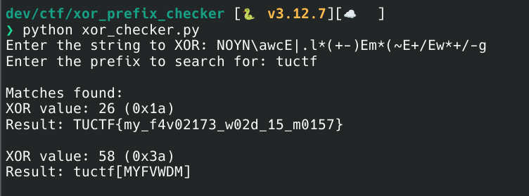

## TUCTF 2025 - Xor-dinary

The challenge description was quite straightforward:

```
Howdy partner, 
I've got this hex encoded string that was XOR'ed against a single character.
Think you can decrypt it for me?
```

and the string attached: `4e4f594e5c617763457c2e6c2a282b2d29456d2a287e452b2f45772a2b2f2d67`

First step was to use e.g. cyberchef to decode it back from hex:

https://cyberchef.org/#recipe=From_Hex('Auto')&input=NGU0ZjU5NGU1YzYxNzc2MzQ1N2MyZTZjMmEyODJiMmQyOTQ1NmQyYTI4N2U0NTJiMmY0NTc3MmEyYjJmMmQ2Nw

which resulted in: `NOYN\awcE|.l*(+-)Em*(~E+/Ew*+/-g`

Since it was clear it is XOR'ed with a single character I came up with a quick & dirty python script to find the 1st match:

```python=
def xor_string_with_char(input_str: str, char: int) -> str:
    return ''.join(chr(ord(c) ^ char) for c in input_str)

def find_xor_with_prefix(input_str: str, prefix: str) -> list[tuple[int, str]]:
    results = []
    prefix = prefix.lower()
    
    for i in range(256):
        result = xor_string_with_char(input_str, i)
        if result.lower().startswith(prefix):
            results.append((i, result))
    
    return results

def main():
    input_str = input("Enter the string to XOR: ")
    prefix = input("Enter the prefix to search for: ")
    
    results = find_xor_with_prefix(input_str, prefix)
    
    if not results:
        print("No matches found!")
    else:
        print("\nMatches found:")
        for xor_val, result in results:
            print(f"XOR value: {xor_val} (0x{xor_val:02x})")
            print(f"Result: {result}")
            print()

if __name__ == "__main__":
    main()

```


which quickly revealed the desired flag. It actually found the 2nd "flag" too :smiling_imp: 



